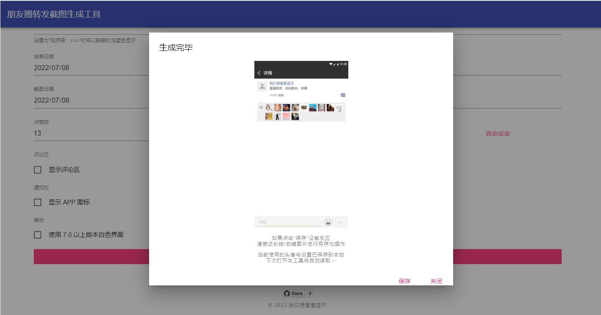

# 朋友圈动态详情截图模拟生成工具

## 环境

- docker
- docker-compose

## 部署

```
//克隆下来
git clone https://github.com/luler/WechatMomentScreenshot.git
//去到项目目录里
cd WechatMomentScreenshot
//执行以下命令
docker-compose up -d
```

注意：项目下的images目录需要拥有写权限，如果在linux服务器部署时存在权限问题，请执行以下命令赋权

```
chmod -R 0777 image
```

## 使用

``` 
直接访问以下链接即可使用

http://127.0.0.1:4321
```

## 使用截图



## 原作参考：

- https://github.com/TransparentLC/WechatMomentScreenshot

> 遵循开源无害无利原则，如有侵权，请联系处理。
> 鉴于原作部分功能存在的不足点，优化如下：

1. 修复优化公众号分享链接标题、封面爬取脚本的问题
2. 增加docker-compose一键部署功能
3. 减少所有外链依赖，让第三方克隆使用人员无顾虑使用
